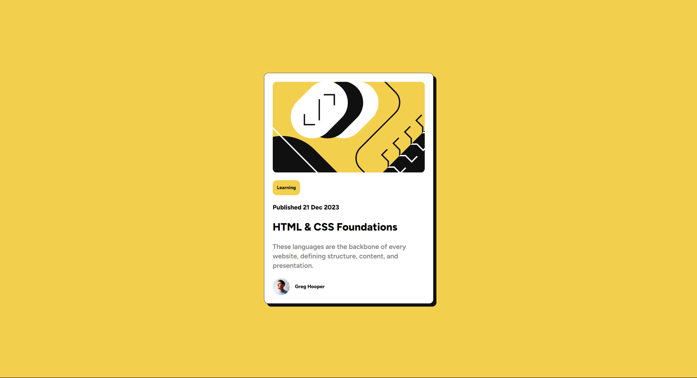

# Frontend Mentor - Blog Preview Card Component Solution

This is a solution to the [blog preview card component challenge on Frontend Mentor](https://www.frontendmentor.io/challenges/blog-preview-card-ckPaj01IcS). Frontend Mentor challenges help you improve your coding skills by building realistic projects. 

## Table of contents

- [Frontend Mentor - blog preview card component solution](#frontend-mentor---blog-preview-card-component-solution)
  - [Table of contents](#table-of-contents)
  - [Overview](#overview)
    - [Screenshot](#screenshot)
    - [Links](#links)
  - [My process](#my-process)
    - [Built with](#built-with)
  - [Author](#author)

## Overview

### Screenshot

### Links

- Solution URL: [https://github.com/nvshanmukh/blog-preview-card](https://github.com/nvshanmukh/blog-preview-card)
- Live Site URL: [https://nvshanmukh.github.io/blog-preview-card/](https://nvshanmukh.github.io/blog-preview-card/)

## My process

### Built with

- Semantic HTML5 markup
- Flexbox

## Author

- Frontend Mentor - [@nvshanmukh](https://www.frontendmentor.io/profile/nvshanmukh)
